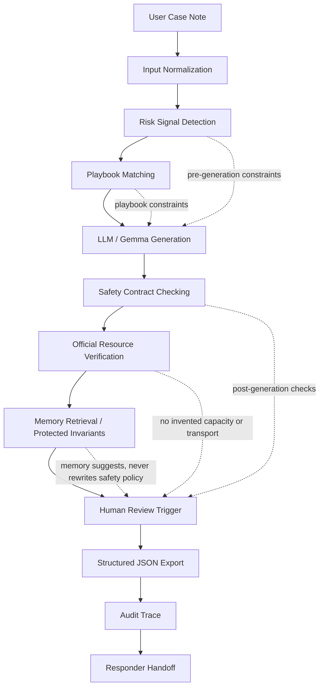

# Resilience Copilot

## Safety-Bounded LLM Agent for High-Risk Decision Support

Resilience Copilot is a safety-bounded LLM agent prototype for disaster-relief case-note triage. It studies how deterministic rules, risk signal detection, bounded memory, tool/resource verification, human review triggers, and audit traces can make LLM-assisted high-risk decision support more reliable and easier to inspect.


## Quick Links

- Live demo: https://huier5635-cmd.github.io/resilience-copilot-gemma4/
- Reusable agent entry: `python -m src.agent --scenario "An older adult uses oxygen and the backup battery is empty during a power outage."`
- Agent implementation: [src/agent/resilience_agent.py](src/agent/resilience_agent.py)
- Local demo runner: [scripts/run_demo.py](scripts/run_demo.py)
- GitHub repository: https://github.com/huier5635-cmd/resilience-copilot-gemma4
- Kaggle writeup: https://www.kaggle.com/competitions/gemma-4-good-hackathon/writeups/new-writeup-1778665719423
- Gemma 4 evidence notebook: https://www.kaggle.com/code/zhenhuier/notebook5022dfd167
- Architecture note: [docs/architecture.md](docs/architecture.md)
- Research problem: [docs/research_problem.md](docs/research_problem.md)
- Threat model: [docs/threat_model.md](docs/threat_model.md)
- Academic evaluation: [docs/academic_evaluation.md](docs/academic_evaluation.md)
- Project report: [docs/project_report.md](docs/project_report.md)
- Reproducibility checklist: [docs/reproducibility_checklist.md](docs/reproducibility_checklist.md)
- Repository audit: [docs/repository_audit_report.md](docs/repository_audit_report.md)

## Start Here

- Want to reuse the safety-bounded agent pattern: run `python -m src.agent --scenario "Older adult uses oxygen and the backup battery is empty during a power outage."`, then open [src/agent/resilience_agent.py](src/agent/resilience_agent.py).
- Want to run the project locally in under a minute: install `requirements.txt`, then run `python scripts\run_demo.py`.
- Want the fastest product tour: open the live demo, run a sample case, then inspect Transfer Brief, Audit Trace, and JSON export.

## Project Background

Disaster-relief volunteers often receive messy notes: missing locations, unverified rumors, medication continuity concerns, transport barriers, language-access needs, pets, and uncertain shelter status. A normal chatbot can produce fluent text, but fluency is not enough in high-risk settings. The harder problem is controlling what the model is allowed to claim, when a human responder must review the case, and how every recommendation can be audited later.

This project turns that problem into a computer-science prototype: a bounded agent that uses an LLM for responder-facing language while deterministic sidecars handle safety constraints, source verification, memory policy, and structured export.

## Core Problem

The project asks:

> How can we build an LLM agent for high-risk case-note processing that remains useful, reproducible, auditable, and bounded by safety rules?

The system does not try to replace emergency services, diagnose medical conditions, or promise live resource availability. It instead converts uncertain notes into a responder handoff that clearly separates known facts, unknowns, official checks, blocked claims, and human review reasons.

## System Architecture



See [docs/architecture.md](docs/architecture.md) for the full module explanation.

## Core Modules

| Module | Role |
| --- | --- |
| Risk Signal Detection | Detects oxygen, medication, heat, flood, language, transport, shelter-rumor, pet, and power-related risk signals. |
| Playbook Matching | Maps detected signals to auditable response constraints in `knowledge_base/emergency_playbook.json`. |
| Gemma Generation | Uses Gemma 4 evidence for responder-facing language generation; local fallback remains deterministic for reproducibility. |
| Deterministic Safety Sidecar | Enforces blocked claims, human review, official-resource-first routing, and response-contract checks. |
| Safety Contract Checking | Verifies the sixteen-section response shape, structured JSON, audit trace, and unsupported-claim rules. |
| Official Resource Verification | Uses an offline sandbox to require official channels before sharing capacity, transport, road, or clinic claims. |
| Bounded Long-Term Memory | Retrieves validated experience while quarantining unreviewed runtime observations. |
| Protected Safety Invariants | Prevent memory or strategy reflection from modifying high-risk safety policy without human review. |
| Human Review Trigger | Marks high-risk and verification-sensitive cases for responder review before final routing. |
| Audit Trace | Records risk level, signals, playbooks, official routes, blocked claims, and review reasons. |

## Quick Start

```powershell
pip install -r requirements.txt
python scripts\run_demo.py
```

Run the reusable package entry point:

```powershell
python -m src.agent --scenario "An older adult uses oxygen and the backup battery is empty during a power outage."
```

Run a specific benchmark case:

```powershell
python scripts\run_demo.py --case-id bench_001_oxygen_power_outage
```

Run a custom case note:

```powershell
python scripts\run_demo.py --scenario "An older adult uses oxygen and the backup battery is empty during a power outage."
```

The project runs in deterministic fallback mode by default. No external API key is required for local validation or evaluation. Optional environment variables are documented in [.env.example](.env.example).

## Demo Usage

Open the public demo and choose one of the sample cases:

https://huier5635-cmd.github.io/resilience-copilot-gemma4/

Each case displays:

- input case note
- detected risk signals
- matched playbooks
- responder-facing generated content
- safety contract checks
- human review reason
- official resource checks
- structured JSON export
- audit trace
- Transfer Brief and responder handoff

## Experiments and Validation

The hackathon did not provide an official training dataset, so the project uses scenario-based local validation and a self-built safety benchmark. Results should be read as engineering validation, not real-world outcome claims.

Run the local validation wrapper:

```powershell
python scripts\run_local_validation.py
```

It reruns the demo, holdout, and stress suites.

Historical locked Kaggle gate:

| Gate | Result |
| --- | ---: |
| Demo cases | 2/2 |
| Holdout cases | 2/2 |
| Stress cases | 15/15 |
| Final local gate | `ready_to_submit=true` |

Run the research-style benchmark:

```powershell
python scripts\run_eval.py
```

Latest self-built benchmark summary: [docs/benchmark_eval_report.md](docs/benchmark_eval_report.md)

Run the academic-style stratified evaluation:

```powershell
python scripts\run_academic_eval.py
```

Latest academic evaluation: [docs/academic_evaluation.md](docs/academic_evaluation.md)

Run the stress report:

```powershell
python scripts\run_stress_test.py
```

Latest stress report: [docs/stress_test_report.md](docs/stress_test_report.md)

Run tests:

```powershell
python -m pytest tests
```

The benchmark compares:

- A. Base LLM fallback
- B. LLM + Risk Signal Detection
- C. LLM + Safety Sidecar
- D. LLM + Safety Sidecar + Memory
- E. LLM + Safety Sidecar + Tool/Resource Verification

Metrics include contract pass rate, unsafe response rate, missing risk signal rate, hallucinated resource rate, human review trigger rate, structured JSON valid rate, and audit trace complete rate.

The academic evaluation additionally reports human-review precision/recall/F1, risk-signal recall, contract completeness, audit completeness, unsafe-claim block rate, stratified metrics by risk and uncertainty type, and a failure taxonomy.

## Safety Mechanisms

Resilience Copilot is intentionally conservative:

- no medical diagnosis
- no invented shelter capacity
- no invented transport availability
- no road-safety guarantees
- no unsupported clinic or pharmacy availability claims
- no child or ad hoc interpreter for sensitive details
- no replacement of emergency services
- human review required for high-risk and verification-sensitive cases
- memory can retrieve examples but cannot rewrite protected safety invariants

## Project Highlights

- Safety-bounded LLM agent architecture for high-risk decision support.
- Deterministic safety sidecar before and after generation.
- Risk signal detection and playbook matching grounded in auditable rules.
- Safety contract checking for a sixteen-section response.
- Official resource verification sandbox for capacity, transport, road, and clinic claims.
- Structured JSON export plus Audit Trace for reproducibility.
- Bounded long-term memory with validation feedback memory and protected safety invariants.
- Human review trigger instead of fully autonomous dispatch.
- Self-built benchmark and stress suite for repeatable safety evaluation.

## Limitations

- The benchmark is hand-authored and small; it is not a real disaster-response dataset.
- The local demo uses deterministic fallback behavior for reproducibility.
- The project does not perform live official-resource lookup.
- The memory system is a bounded prototype; human review is required before long-term promotion.
- The system is not a medical tool, emergency dispatch tool, or autonomous rescue system.

## Future Work

- Add expert-reviewed benchmark annotations.
- Replace the offline tool sandbox with approved official-resource APIs.
- Extend the memory write gate with review workflows and provenance signatures.
- Add multi-agent planning only under deterministic safety contracts.
- Evaluate cross-model transfer with Gemma, Qwen, DeepSeek, GPT, and local models.
- Study memory pollution, policy drift, and auditability in high-risk LLM agents.

## Research Keywords

Trustworthy AI, LLM safety, agent safety, high-risk decision support, human-in-the-loop AI, audit trace, tool calling sandbox, bounded memory, memory pollution, safety contract, disaster informatics, responsible AI.

## Research Materials

- [Research problem](docs/research_problem.md)
- [Related work](docs/related_work.md)
- [Threat model](docs/threat_model.md)
- [Academic evaluation](docs/academic_evaluation.md)
- [Failure taxonomy](docs/failure_taxonomy_report.md)
- [Reproducibility checklist](docs/reproducibility_checklist.md)
- [Manuscript outline](docs/paper_outline.md)
- [References](docs/references.bib)
