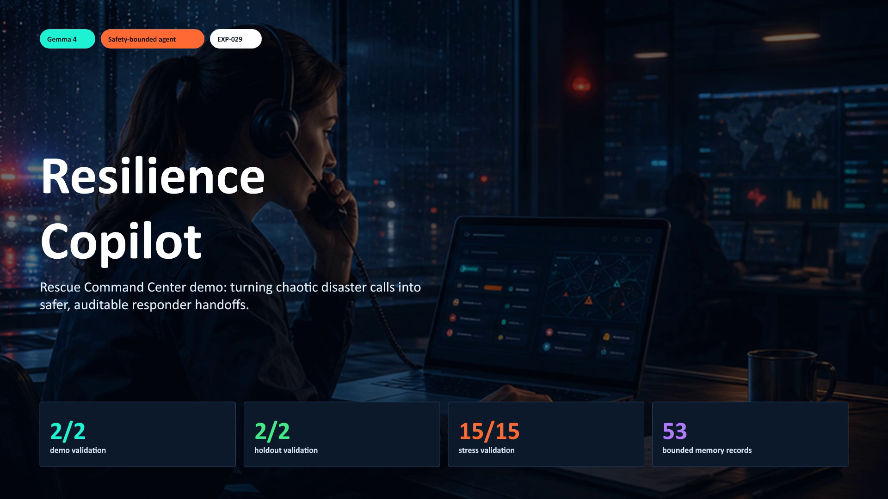

# Resilience Copilot

Safety-first disaster relief triage assistant built with Gemma 4, deterministic safety constraints, bounded memory, and LangGraph-compatible agent orchestration.

## V4 Command Center Pitch

The latest presentation asset is the **Rescue Command Center** version:

- [V4 pitch deck](resilience_copilot_pitch_v4_command_center.pptx)
- [V4 narration script](resilience_copilot_pitch_v4_narration_script.txt)

## Read This Project

- [Full English README](README_EN.md)
- [Chinese README](README_CN.md)
- [Live demo](https://huier5635-cmd.github.io/resilience-copilot-gemma4/)
- [Kaggle Gemma 4 evidence notebook](https://www.kaggle.com/code/zhenhuier/notebook5022dfd167)
- [Submitted Kaggle writeup](https://www.kaggle.com/competitions/gemma-4-good-hackathon/writeups/new-writeup-1778665719423)

## 30-Second Summary

Resilience Copilot turns messy disaster-relief case notes into safer, responder-reviewed next actions. It detects risk signals, matches auditable playbook constraints, uses Gemma 4 for responder-facing language, checks a sixteen-section safety contract, and exports JSON plus audit trace and transfer brief.

The current agent prototype includes:

- LangGraph-compatible graph orchestration with planner, coordinator, specialist, safety-checker, and summary nodes.
- Bounded long-term memory with episodic, semantic, procedural, and reflective memory layers.
- Experience ledger, validation feedback memory, strategy reflection, skill library, and no-network tool calling sandbox.
- Deterministic safety sidecar that blocks diagnosis, invented shelter capacity, invented transport availability, and unsupported claims.

## Validation

| Gate | Result |
| --- | --- |
| Demo cases | 2/2 |
| Holdout cases | 2/2 |
| Stress cases | 15/15 |
| Memory system | ready |
| Graph orchestration | ready |
| Final local gate | `ready_to_submit=true` |

## Final Package

The final judge-facing bundle is:

`resilience_copilot_submission_bundle_EXP029.zip`

It contains the writeup, evidence matrix, validation reports, Gemma 4 runtime evidence, reproducibility scripts, static demo, V4 command-center pitch deck, memory artifacts, and graph-orchestration traces.
