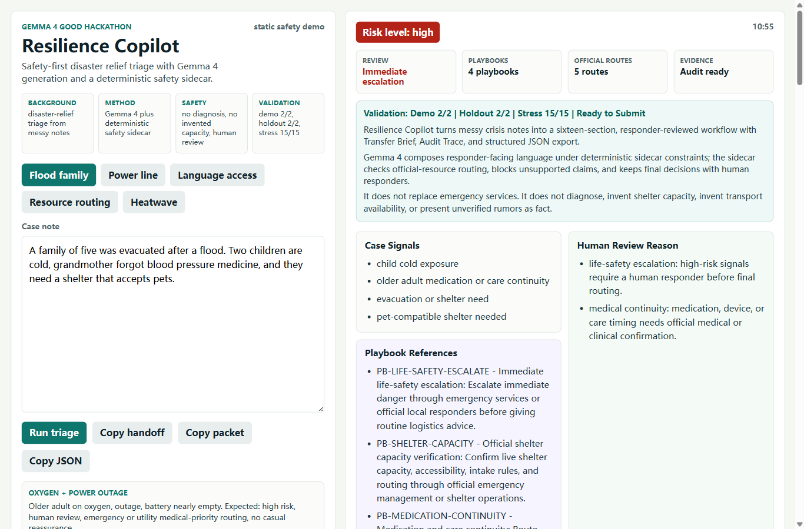

# Resilience Copilot 中文说明

语言版本：[README.md](README.md)

Resilience Copilot 是一个面向高风险人工复核场景的安全边界智能体模板。当前旗舰 Demo 是灾害救援分诊助手：它把志愿者收到的混乱求助记录，转成更安全、可审计、可交接的下一步行动建议。

项目使用 Gemma 4 生成面向救援人员的自然语言响应，同时用确定性安全侧车执行风险识别、行动手册约束、官方资源核验、16 段响应契约、Transfer Brief、Audit Trace 和结构化 JSON 导出。



## 为什么值得收藏

- 它不是单纯聊天机器人，而是一个可复用的安全智能体工程模板。
- 它把 LLM 生成、确定性约束、本地验证、审计轨迹和人工复核放在同一条闭环里。
- 它已经具备离线智能体能力：经验账本、验证反馈记忆、长期记忆、策略反思、技能库、工具调用沙盒和图式编排。
- 它适合迁移到校园安全、养老热线、政务工单、公益救助、保险理赔初筛和合规客服等场景。

## 快速查看

| 内容 | 链接 |
| --- | --- |
| 在线 Demo | https://huier5635-cmd.github.io/resilience-copilot-gemma4/ |
| 架构说明 | [docs/architecture.md](docs/architecture.md) |
| 示例案例 | [docs/examples.md](docs/examples.md) |
| 复用指南 | [docs/adaptation_guide.md](docs/adaptation_guide.md) |
| 版本说明 | [docs/release_notes_v0.1.0.md](docs/release_notes_v0.1.0.md) |
| Kaggle Writeup | https://www.kaggle.com/competitions/gemma-4-good-hackathon/writeups/new-writeup-1778665719423 |
| Gemma 4 证据 Notebook | https://www.kaggle.com/code/zhenhuier/notebook5022dfd167 |

## 30 秒架构

```text
Case Note
  -> Risk Signal Detector
  -> Playbook Matcher
  -> Gemma 4 Generation
  -> Safety Contract Checker
  -> 16-section Response
  -> JSON Export + Audit Trace + Transfer Brief
```

智能体学习侧车：

```text
Validation Feedback
  -> Experience Ledger
  -> Bounded Long-Term Memory
  -> Strategy Reflection
  -> Human-Reviewed Skill Library
  -> Next-Round Policy Suggestions
```

这个系统不是无约束自主智能体。它不会自动拨打急救电话，不会诊断病情，不会预订避难所，也不会承诺实时容量。所有学习和策略升级都必须经过人工复核。

## 核心安全机制

- 高风险案例必须进入人工复核。
- 不替代 emergency services。
- 不做医疗诊断，不给治疗建议。
- 不虚构避难所容量、道路安全、交通可用性或冷却中心容量。
- 社交媒体传言和口头传言进入 rumor quarantine，必须等待官方渠道确认。
- 记忆系统只能提出候选改进，不能自动修改高风险策略。
- 工具调用沙盒只做离线模拟，不执行真实外部操作。

## 验证结果

| Gate | Result |
| --- | --- |
| Demo cases | 2/2 |
| Holdout cases | 2/2 |
| Stress cases | 15/15 |
| Memory system | ready |
| Graph orchestration | ready |
| Final local gate | `ready_to_submit=true` |

复现命令：

```powershell
python scripts\run_local_validation.py
```

## 如何复用

这个项目的公开仓库现在按“可复用模板”来整理：

- 根目录负责展示项目、运行静态 Demo、说明验证结果。
- `docs/architecture.md` 解释系统架构和安全边界。
- `docs/examples.md` 展示三类典型案例。
- `docs/adaptation_guide.md` 说明如何迁移到其他高风险人工复核场景。
- `CHANGELOG.md` 和 `SECURITY.md` 说明版本变化和安全问题反馈方式。
- 大型比赛附件、私有学习记录和旧草稿不放在 GitHub 根目录。

## 后续路线

接下来适合把项目从比赛作品继续演进为开源工具包：

- 抽象 safety contract checker。
- 抽象 playbook grounding。
- 增加更多高风险场景模板。
- 提供 Docker 和一键运行脚本。
- 增加更多验证案例。
- 把离线工具沙盒升级成白名单官方资源查询适配器。

详情见 [ROADMAP.md](ROADMAP.md)。
