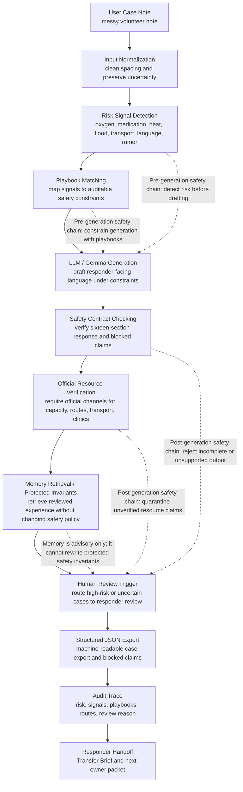

# System Architecture

Resilience Copilot is a safety-bounded LLM agent prototype for high-risk disaster-relief case-note triage. Its design separates language generation from safety-critical control logic: the LLM drafts responder-facing text, while deterministic modules decide risk signals, playbook constraints, resource checks, human review triggers, and audit fields.

## Module Notes

| Module | Short explanation |
| --- | --- |
| User Case Note | Raw message from a volunteer, household, or coordinator. It may contain rumors, missing facts, and urgent risks. |
| Input Normalization | Keeps the original meaning but standardizes text for deterministic detection. |
| Risk Signal Detection | Finds operational risk signals such as oxygen outage, child cold exposure, insulin continuity, floodwater, language barrier, or shelter rumor. |
| Playbook Matching | Selects auditable constraints from `knowledge_base/emergency_playbook.json`. |
| LLM / Gemma Generation | Uses Gemma 4 for natural-language drafting in the Kaggle evidence path; local scripts use deterministic fallback for reproducible validation. |
| Safety Contract Checking | Checks the fixed sixteen-section response, structured JSON, audit trace, and unsupported-claim patterns. |
| Official Resource Verification | Keeps capacity, route, transport, and clinic availability in an "unknown until official source confirms" state. |
| Memory Retrieval / Protected Invariants | Retrieves validated experience and reusable skills, but cannot update high-risk policy automatically. |
| Human Review Trigger | Requires human review when risk is high or operational facts need official confirmation. |
| Structured JSON Export | Produces machine-readable fields for downstream audit and handoff. |
| Audit Trace | Records why the system made each routing and safety decision. |
| Responder Handoff | Converts the case into Transfer Brief, responder packet, and household-facing holding message. |

## Safety Design

The core design choice is to put safety-critical decisions outside free-form generation. Memory, reflection, and tool use can help retrieve context or propose future improvements, but they cannot override:

- no diagnosis
- no invented live capacity
- no invented transport availability
- no road-safety guarantees
- no replacement of emergency services
- human review for high-risk cases

## Academic Architecture View

The research framing names the system **Safety-Bounded LLM Agent with Deterministic Sidecar and Memory Write Gate**. It uses three boundaries:

- **Generation boundary**: the LLM drafts responder-facing language under constraints.
- **Policy boundary**: risk rules, playbooks, resource checks, and contract checks decide safety behavior.
- **Memory boundary**: memory can retrieve reviewed experience and propose updates, but it cannot update protected invariants.

```mermaid
flowchart LR
    subgraph "Input and Pre-Generation Safety"
        A["Case Note"] --> B["Input Normalization"]
        B --> C["Risk Signal Detector"]
        C --> D["Playbook Matcher"]
    end

    subgraph "Generation Boundary"
        D --> E["Gemma / LLM Drafting"]
    end

    subgraph "Post-Generation Safety"
        E --> F["Safety Contract Checker"]
        F --> G["Official Resource Verification"]
        G --> H["Human Review Trigger"]
    end

    subgraph "Memory Boundary"
        M1["Runtime Observation"] --> M2["Quarantine"]
        M2 --> M3["Human Review"]
        M3 --> M4["Approved Memory"]
        M4 --> M5["Memory Retrieval"]
        M5 -. "advisory context only" .-> E
        M5 -. "cannot rewrite" .-> P["Protected Safety Invariants"]
    end

    H --> I["Structured JSON Export"]
    I --> J["Audit Trace"]
    J --> K["Responder Handoff"]
    P -. "enforced by sidecar" .-> F
```

This design intentionally avoids unrestricted autonomy. The agent can organize a case, retrieve reviewed experience, run an offline verification sandbox, and prepare a handoff, but high-risk policy changes and operational escalation remain human-reviewed.
